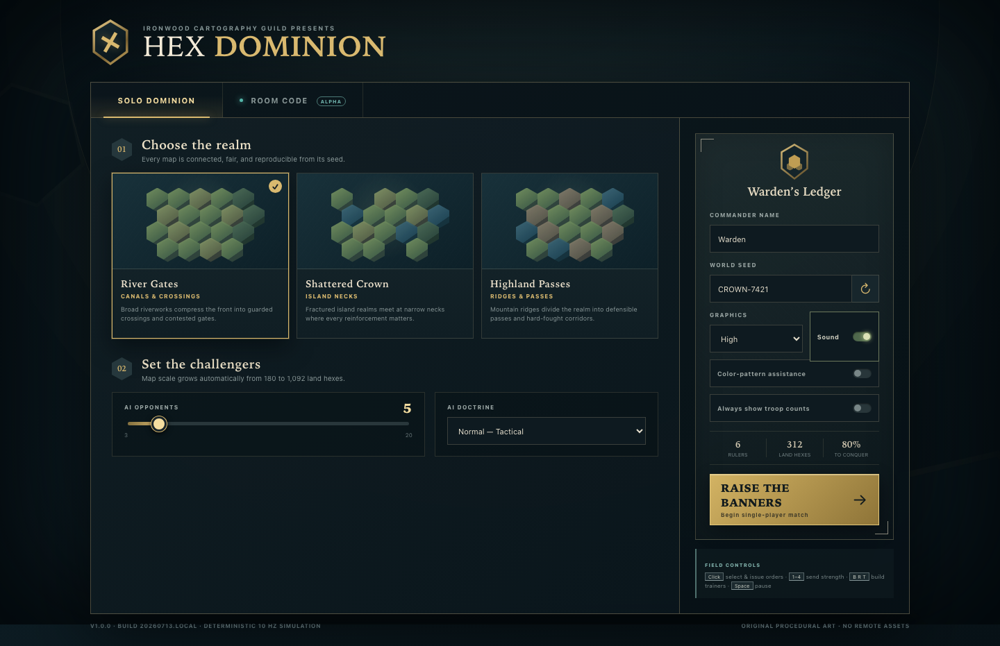
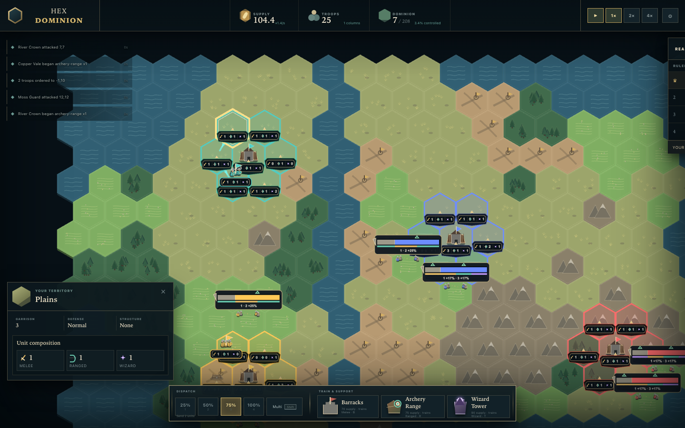
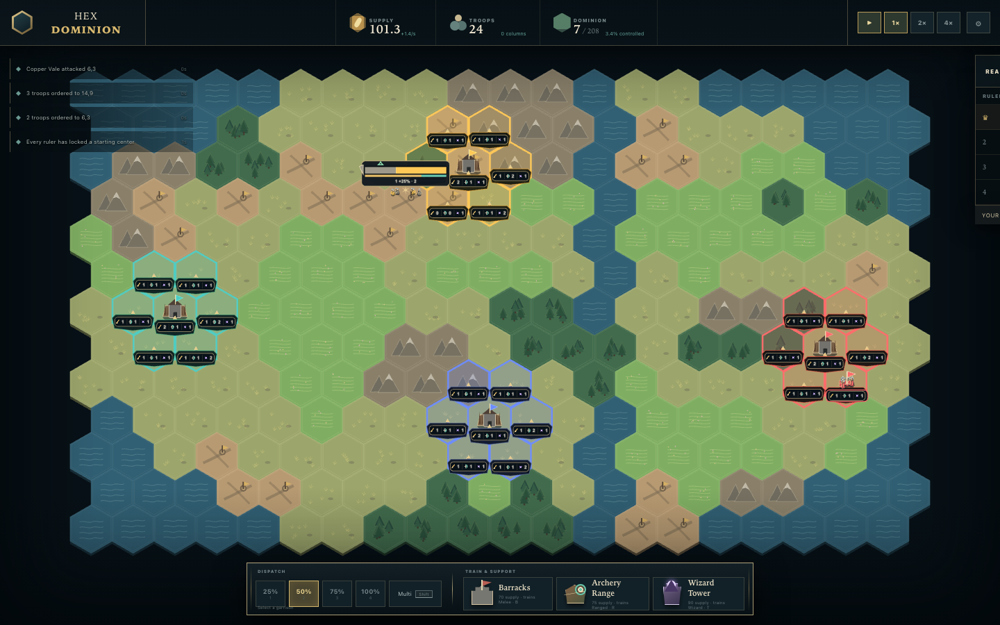
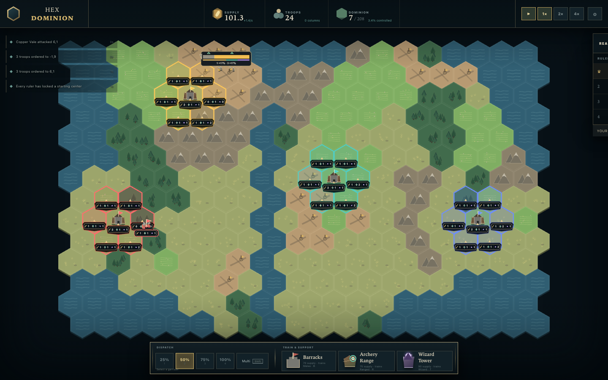
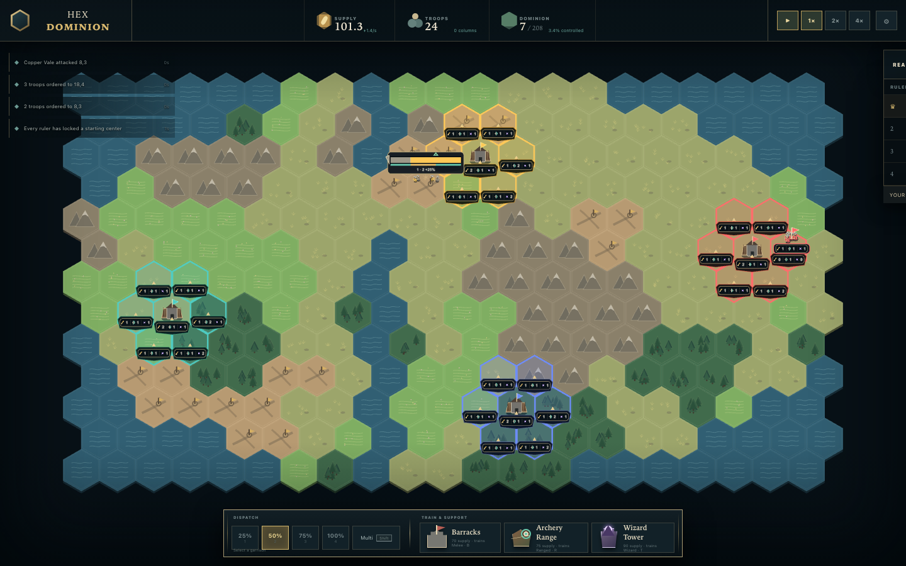
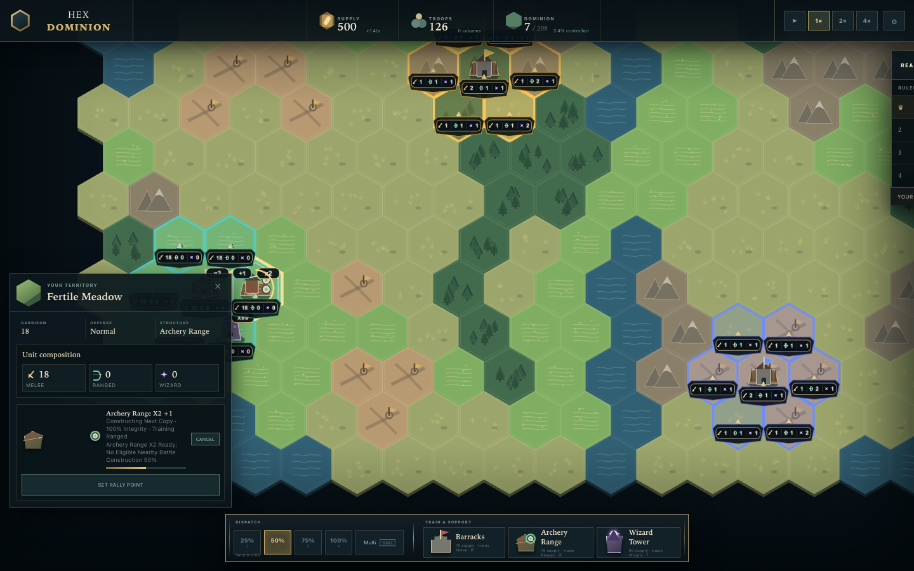
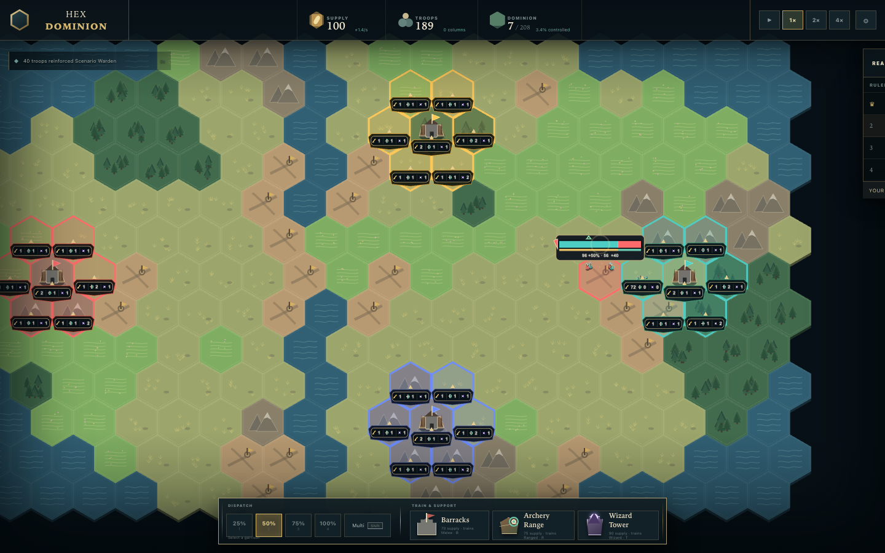
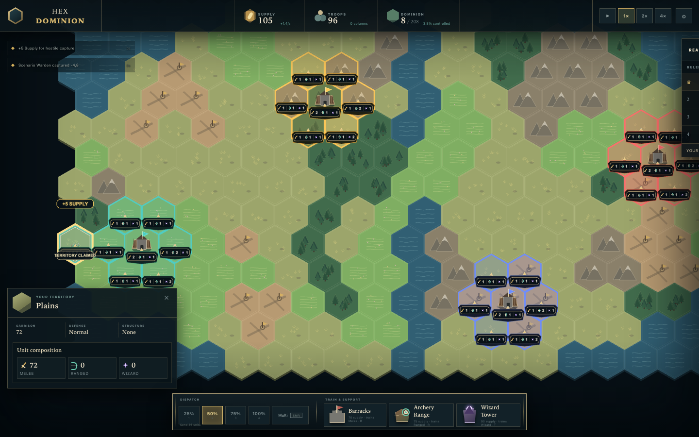

# Hex Dominion

[](https://github.com/enel1221/hexgame/actions/workflows/ci.yml)
[](https://github.com/enel1221/hexgame/actions/workflows/security.yml)

Hex Dominion is a real-time browser strategy game about commanding Melee, Ranged, and Wizard armies across a compact seeded hex realm. One human commander faces 3–20 deterministic AI rulers on one of three connected chokepoint archetypes. Commanders choose a fair seven-hex opening, move exact typed armies singly or as atomic groups, stack military structures up to x99, and fight true multi-ruler battles. Wizard beats Melee, Ranged beats Wizard, and Melee beats Ranged. Every producer trains its own type, fortifies its home tile, supports adjacent battles, and can rally new units toward the front.

The game uses a React/vinext-on-Vite application shell, a PixiJS 8 battlefield, a pure TypeScript simulation running at 10 Hz in a Web Worker, and an optional Cloudflare Durable Object command relay for casual room-code multiplayer.

## Screenshots

The visual suite writes deterministic, named captures to `docs/screenshots/`. Run `npm run test:visual` to refresh them.

| Setup                                                   | Active match                                                   |
| ------------------------------------------------------- | -------------------------------------------------------------- |
|  |  |

| River Gates                                        | Shattered Crown                                           | Highland Passes                                             |
| -------------------------------------------------- | --------------------------------------------------------- | ----------------------------------------------------------- |
|  |  |  |

| Structures                                     | Reinforced battle                                               | Capture transition                                             |
| ---------------------------------------------- | --------------------------------------------------------------- | -------------------------------------------------------------- |
|  |  |  |

The capture inventory, fixed seeds, viewports, and review checklist are in [docs/VISUAL_QA.md](docs/VISUAL_QA.md). Generated files are evidence to inspect, not proof that visual review happened.

## Requirements

- Node.js 22.13 or newer.
- npm and the committed `package-lock.json`.
- A current Chromium, Firefox, or WebKit-class browser with canvas/WebGL support.
- Wrangler authentication only when running or deploying the optional multiplayer relay.

## Install

```bash
npm ci
```

Copy the local environment example only when you need to change multiplayer relay settings:

```bash
cp .env.example .env.local
```

The example contains public URLs and non-secret local defaults. Never commit Cloudflare API tokens.

## Run single-player locally

```bash
npm run dev
```

Open `http://localhost:3000`, choose a realm, set 3–20 AI opponents, enter a seed, and select **Raise the banners**. On the neutral map, choose any highlighted eligible center, review the provisional seven-hex footprint, and press **Lock In**. The ordinary simulation remains at tick 0 while you choose; deterministic AI rulers visibly consider and lock their own starts. Single-player has no placement deadline and does not require the edge relay.

In a local development build, add `?debug=1` to expose the browser inspection surface and performance overlay used by Playwright. Selection helpers still route through normal UI validation. Debug matches also expose deterministic, frozen presentation fixtures for structures, combat, capture, victory, and defeat; loading one deliberately replaces Worker state and is rejected unless the match was created with debug enabled. Production builds ignore the URL flag and do not expose this API.

## Run two-tab multiplayer locally

```bash
npm run dev:all
```

This starts:

- the game at `http://localhost:3000`;
- the relay at `http://127.0.0.1:8787`;
- the relay health endpoint at `http://127.0.0.1:8787/health`.

Then:

1. Open two separate browser contexts or profiles.
2. In the first, open **Room Code**, choose **Create**, select the optional bot count (`None — humans only` is valid), and create a war room.
3. In the second, open **Room Code**, choose **Join**, and enter the six-character code.
4. Mark the joining banner ready. A newly created host banner begins ready.
5. Start placement from the host. Every provisional footprint and lock state is shared; all remaining starts are deterministically assigned when the 30-second placement deadline expires.
6. After everyone locks, let the opening handoff finish, issue an order from each client, and compare their debug state hashes at the same tick.
7. Close and reopen one client to exercise placement or match reconnect-token recovery.

The relay is an experimental deterministic command sequencer, not an authoritative anti-cheat server. See [docs/MULTIPLAYER.md](docs/MULTIPLAYER.md) for the protocol and local recovery flow.

## Controls

| Input                                   | Action                                                               |
| --------------------------------------- | -------------------------------------------------------------------- |
| Click/tap an owned garrison             | Select a source tile                                                 |
| Click/tap a destination                 | Issue a friendly move or one final hostile step                      |
| Hold `Shift`, then click owned tiles    | Toggle atomic Multi sources                                          |
| Release `Shift`                         | Choose one destination, or hold `Shift` again to toggle several      |
| Touch **Multi**                         | Use explicit Select Sources, Choose Targets, Send, and Cancel phases |
| Drag or middle-mouse drag               | Pan the battlefield                                                  |
| Mouse wheel / pinch                     | Zoom around the pointer or touch midpoint                            |
| WASD / arrow keys                       | Pan while the battlefield canvas is not keyboard-focused             |
| Focus canvas, then arrows + Enter/Space | Move the hex cursor and select a source, destination, or Multi tile  |
| Double-click                            | Center the clicked tile                                              |
| Right-click or `Esc`                    | Safely cancel selection, build mode, or Multi mode                   |
| `1`, `2`, `3`, `4`                      | Send 25%, 50%, 75%, or 100% (every source retains one unit)          |
| `B`, `R`, `T`                           | Build/add a Barracks, Archery Range, or Wizard Tower copy            |
| Producer **Set/Clear Rally Point**      | Route only newly trained typed units to a persistent destination     |
| `Space`                                 | Pause/resume single-player                                           |

The HUD also provides pause, 1x, 2x, and 4x controls. Barracks require an owned Muster Ground and train Melee; Archery Ranges require an owned Fertile Meadow and train Ranged; Wizard Towers train Wizards on any owned land. A tile may hold x1 through x99 completed copies of one structure type, with at most one additional copy under construction; structure types never mix on one tile. Exact M/R/W counts remain visible in the tile inspector, moving-army plates, and battle details.

## Test and verify

```bash
npm run lint
npm run typecheck
npm test
npm run test:e2e
npm run test:visual
npm run build
npm run build:edge
```

`npm test` includes unit, simulation, and network protocol coverage. The Playwright commands start the local app through `playwright.config.ts`; they require an already installed Playwright browser and do not install one automatically.

Run the complete gate with:

```bash
npm run verify
```

The visual command creates curated PNGs in `docs/screenshots/`; review those images using [docs/VISUAL_QA.md](docs/VISUAL_QA.md) before accepting a visual change.

## Production build

```bash
npm run build
npm run build:edge
```

The first command builds the vinext application. The second performs a dry-run build of the standalone multiplayer Worker into `dist-edge`.

## Cloudflare configuration and deployment

The app and relay deploy independently. Set the browser-visible relay URL when building the app:

```bash
NEXT_PUBLIC_MULTIPLAYER_URL=https://hex-dominion-multiplayer.<account-subdomain>.workers.dev
```

Relay configuration lives in `wrangler.multiplayer.jsonc`. Its `ROOMS` binding uses SQLite-backed Durable Objects and the forward-only `v1` migration. Configure exact allowed origins before production deployment.

```bash
npx wrangler login
npm run deploy:edge
npm run build
npx vinext deploy --name hex-dominion
```

Read [docs/DEPLOYMENT.md](docs/DEPLOYMENT.md) before deploying; it covers credentials, origin policy, migration safety, production smoke tests, and rollback. Architecture and tuning references are in [docs/ARCHITECTURE.md](docs/ARCHITECTURE.md) and [docs/BALANCE.md](docs/BALANCE.md).

## Known limitations

- Multiplayer is a casual alpha. The relay validates identity, ordering, and message shape, but each browser simulates the match and a modified client can cheat.
- Rooms are ephemeral and expire; there is no account system, matchmaking, spectator mode, chat, or permanent replay archive.
- Local autosaves are browser-local, schema-versioned snapshots. Clearing site storage removes them.
- A 21-player match still has a heavier initial generation/render cost than an ordinary 4–8-player match, although the compact cap is now 1,092 land tiles.
- The MVP has no teams, alliances, diplomacy, fog of war, naval units, campaign, or ranked play.

Hex Dominion is available under the [MIT License](LICENSE).

## Hosted environments

- `main` continuously deploys to <https://main.hex-dominion.inkgrid.io>.
- The latest `v*` release tag deploys to <https://hex-dominion.inkgrid.io>.

The title screen and in-game campaign ledger show the semantic version and a UTC-dated build
number. Deployment credentials are stored only in protected GitHub environments. Security reports
should use the private process in [SECURITY.md](SECURITY.md), not public issues.
