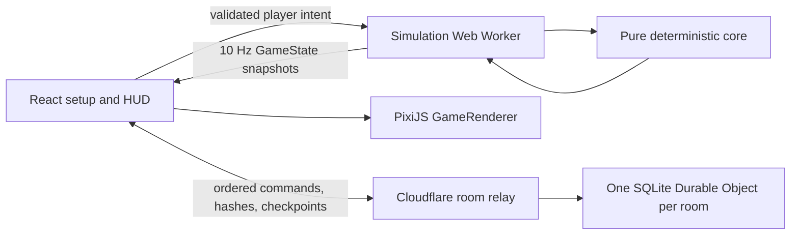

# Architecture

Hex Dominion separates rules, scheduling, rendering, interface state, and room coordination so the same ordered inputs can drive a headless test, a single-player Worker, or every client in a multiplayer room.

## Runtime boundaries

- `src/core/` owns all authoritative rules. It has no DOM, React, PixiJS, or Cloudflare dependency.
- `src/worker/game.worker.ts` owns a `GameEngine`, runs its fixed-step cadence, and returns initial/state/snapshot/error messages.
- `src/client/GameApp.tsx` owns setup, HUD, local preferences, selection, menus, autosave, and multiplayer transport coordination.
- `src/client/render/GameRenderer.ts` draws and animates one PixiJS canvas. It consumes state but never changes authoritative rules.
- `src/edge/` owns HTTP/WebSocket validation, room identity, ordered relay sequences, checkpoint transport, and room expiry. It does not run a high-frequency game simulation.
- `src/shared/` contains balance constants and JSON-compatible cross-boundary types.

## Fixed-step simulation

The simulation rate is ten ticks per second (`TICKS_PER_SECOND = 10`). Placement has its own deterministic `elapsedTicks` clock while the ordinary match tick remains 0. During that pre-match phase only spawn claims, locks, deterministic AI relocations, and timeout allocation may change authoritative state; economy, movement, construction, combat, AI gameplay, victory, and the ordinary simulation tick do not advance. The presentation-only opening handoff leaves the state in `opening` until the client has focused the local center and shown the center-then-ring claim animation.

Once the phase is `running`, a tick executes in a stable order:

1. increment the integer tick;
2. apply due player commands in submission/relay order;
3. evaluate due deterministic AI rulers and apply their legal commands;
4. advance moving stacks;
5. advance N-faction battles using typed RPS power plus local/adjacent building support from a pre-application snapshot;
6. detect, advance, reset, or complete encirclements;
7. advance construction, repair, and aggregate typed production/rally dispatch;
8. settle economy when the tick reaches a whole simulation second;
9. refresh player tile/troop/structure aggregates;
10. evaluate victory;
11. compute the stable state hash.

Pause prevents the tick from advancing. The 1x, 2x, and 4x controls change only how frequently the Worker requests ticks; movement, construction, economy, combat, AI, and victory all continue to use tick counts.

The Worker timer is a scheduling mechanism, not a rules input. Core code does not read wall-clock time. `performance.now()` is used only to report diagnostic simulation duration.

## Commands and validation

The shared `GameCommand` union contains spawn choice/lock, move, atomic multi-move, build/add-copy, cancel-build, toggle-production, and set/clear-rally commands. Human UI, AI, replay, and multiplayer all pass through `validateCommand`/`applyCommand`.

A `GameEngine` schedules submitted commands no earlier than the next tick. Multiplayer can supply a future `scheduledTick`; the room relay replaces client timing with its ordered target tick. Invalid commands do not mutate state. Accepted commands enter `commandHistory`, which supports deterministic replay from a matching configuration.

Movement paths may cross owned land and make at most one final hostile step. A route cut during travel is recalculated from the current owned tile; if no legal route remains, the stack returns to its last owned position. Multi-move validation uses the same pure planner as the UI preview: it canonicalizes at most 64 sources and 16 destinations, computes all contributions, equal destination quotas, paths, and a bounded minimum-cost allocation from one pre-mutation state, and mutates nothing unless the complete plan is feasible. One multi-move remains one scheduled command and one history entry even when its plan creates several aggregate moving stacks.

Every producer uses the ordinary movement reachability rule for rally validation. One structure stack has one retained destination. A completed cycle produces one affordable aggregate batch of its own unit type without a troop-storage cap, dispatches only newly trained units, and retains blocked-rally output locally until a legal route returns.

## Determinism

The deterministic contract is:

- integer ticks and fixed-point Supply (`1 Supply = 1,000 milli-Supply`);
- JSON-compatible state with no class instances inside snapshots;
- xmur3 string hashing plus a Mulberry32-style integer PRNG in `src/core/rng.ts`;
- seed-derived streams for map generation, decoration, spawn eligibility, spawn troop distribution, deterministic AI placement, and each gameplay AI ruler;
- no `Math.random()` in deterministic modules;
- lexicographically sorted object keys before hashing;
- a two-lane, 16-hex-character state hash;
- no graphics, sound, color-pattern, full-count, local-seat, player-name, or debug preferences in the rules hash;
- no wall-clock, browser layout, or renderer interpolation in rules decisions.

Map generation retries with `seed:map-retry:<attempt>` and accepts only a fairness report that satisfies connectivity, terrain distribution, controlled-gate, and spawn-distance checks. It deterministically carves an impassable water seam, preserves one or two land gates by archetype, refills carved land in canonical order to retain the exact target, and rejects uncontrolled articulation chains. Bot seats are reserved from one seed-derived vector shared by the core and relay, so their two visible relocations can finish and lock without depending on human or reconnect timing. The faint placement overlay previews centers with a complete padded footprint, no current/reserved collision, and exact nearest-distance balance. Authoritative selection uses the same bounded projection; the core applies the vector to a cloned neutral map and runs the full fairness report before acceptance. The requested seed remains public, `generationAttempt` records the deterministic retry, and `config.startingCenters` records the immutable final placement input.

## State snapshots and resume

`EngineSnapshot` contains a versioned `GameState`, accepted command history, and commands that the Worker accepted but scheduled after the snapshot tick. Export and import deep-clone through the same JSON-compatible representation and recompute the state hash. A restored Worker therefore continues from the stored placement/match tick without dropping an order that was still pending.

Version 3 stores canonical Melee/Ranged/Wizard counts on tiles, moving stacks, battle participants, casualty remainders, and blocked rally queues. It also stores typed producer stacks and generalized production state. The parser strictly validates and hash-checks version 1 and 2 payloads before chaining their migrations: scalar armies are distributed without count loss, Farm/Barracks/Turret become Archery Range/Barracks/Wizard Tower, old commands are mapped to current names, and derived player totals are rebuilt before the new hash is accepted. Migration never silently drops a malformed save.

Single-player requests and writes the complete Worker snapshot every 150 ticks (15 simulation seconds) and immediately after entering pause. Resume validates the complete versioned shape, cross-references, participant/entity bounds, command payloads, and stored deterministic hash. Invalid JSON, tampered data, and malformed saves are removed with a recoverable message rather than replacing the live engine.

In multiplayer, the host periodically publishes a size-bounded checkpoint tagged with the latest applied relay sequence. Plain JSON remains readable for backward compatibility; current clients gzip and base64-encode the version-3 envelope when needed so a 21-player map fits the relay limit. Checkpoints intentionally clear `pendingCommands`: commands after that applied sequence remain owned by the ordered relay log and would otherwise be applied twice. The relay rejects a checkpoint whose tick has already passed any command excluded by its sequence, so the restore base can never strand an uncovered order. A reconnect decodes and strictly validates the checkpoint, deduplicates and queues subsequent relay commands, requests additional pages when necessary, then tells the Worker to catch up to `serverTick` (or the recorded final tick) before normal real-time ticking continues. See [MULTIPLAYER.md](MULTIPLAYER.md).

## Debug acceptance fixtures

Development debug matches expose frozen, deterministic structures, battle, reinforcement, capture, victory, and defeat states to browser acceptance tests. The fixture request replaces the current Worker state so short-lived renderer transitions can be captured reliably. The debug surface also retains a bounded history of recent Worker publications so two browser contexts can compare the same simulation tick even when their renderer phases differ. Both the browser API and Worker guard these inspection paths with `config.debug`, and production builds ignore the debug URL flag entirely; fixtures are never part of normal command handling or deterministic replay.

## Rendering and interpolation

The Worker sends authoritative state at tick boundaries. Rendering fills the 100 ms gaps without feeding visual values back into the core:

- a stack's rule position is `pathIndex`, `segmentProgress`, and `segmentDuration`;
- PixiJS derives a smoothstep position between adjacent axial tile centers;
- the visible stack container eases toward each new target position;
- soldier limbs use frame-time animation only for presentation;
- battle state exposes one canonical participant per active faction, exact typed counts, and integer control shares totaling 10,000;
- the battle bar eases one color/pattern effective-share segment per participant, places an `x1.xx` type multiplier inside every segment wide enough to label, and keeps late entrants/reinforcements readable without inventing a coalition;
- battle presentation adds paired fighters, strike animation, particles, and a brief bright impact segment without changing combat state;
- ownership changes create a directional edge-wipe before the displayed border/tint commits;
- capture and reward events create short world-space labels over the affected tile.
- placement footprints, locks, rally paths, Multi rings/numbered targets/route fans, battle type multipliers, detailed typed building support, and enclosure perimeters are presentation layers over authoritative state;
- x2–x99 structure badges and support effects never create one retained object or projectile per copy.

Static terrain geometry is drawn when a map first arrives. Ownership is retained and redrawn only when a capture wipe completes instead of on every state tick. Labels, structures, stacks, and battles are updated in retained PixiJS layers. HUD panels remain semantic HTML/CSS for accessibility and responsive layout.

If the browser loses its WebGL context, the renderer prevents permanent disposal, stops only the presentation ticker, and shows a recovery status while the Worker simulation remains safe. On restoration it rebuilds retained layers from the latest authoritative state, restarts rendering, and reports success.

## AI scheduling

AI uses the same legal command path as the human. Difficulty changes decision interval, candidate cap, reserve, attack-confidence threshold, send percentage, and seeded score jitter; it does not change economy or combat rules.

Evaluation is staggered by player ID: `(tick + playerId * 7) % interval === 0`. Easy, Normal, and Hard evaluate every 30, 20, and 10 ticks respectively. Candidate sets are capped at 14, 28, and 48. Each due ruler considers participant-aware reinforcement and favorable third-party entry, enclosure breakout/ring defense, expansion/attack, interior mobilization, rallying, and development. Structure evaluation counts completed copies while preferring useful geographic spread before extreme stacks. This staggering and pruning bound the 20-AI case without making decisions depend on available CPU time.

## Performance approach

- Simulation and AI run off the main thread.
- The map is one canvas, not one DOM node per hex.
- Terrain is retained in a static PixiJS graphics layer until the map changes.
- Garrison, structure, stack, and battle objects are reused by stable IDs and destroyed when no longer present.
- Repeated M/R/W labels use `BitmapText`.
- A moving stack renders representative typed soldiers rather than one object per unit.
- A tile keeps one aggregate producer object through x99; one cycle creates at most one typed batch, and local/adjacent support is derived without per-copy simulation objects.
- Low zoom hides non-border garrison labels unless selected.
- Graphics quality changes deterministic decorative density, not game information.
- State events are capped at the most recent 24.
- Camera input, visual easing, and effects are frame-time work; rules remain fixed-step.
- Worker tick hooks measure the AI phase independently from whole-tick simulation duration; timing remains diagnostic and never enters state.
- The debug overlay reports FPS, simulation and AI milliseconds, tick, stack/battle counts, retained visible-object count, seed, and hash.

## Multiplayer boundary

The Durable Object orders commands and persists compact recovery data, but every browser runs the deterministic core. Applied relay-sequence tracking, checkpoint restoration, and Worker catch-up keep reconnects aligned without making the edge service run ticks. The client serializes asynchronous checkpoint decoding with subsequent relay frames. Each multiplayer Worker buffers sequence gaps and retains a base plus four recent 50-tick rollback points: if a relay batch arrives after its authoritative target tick was already published, the Worker restores the latest pre-target point once the contiguous prefix is available, inserts accepted and pending commands in exact relay-sequence order, and deterministically replays to its prior tick. Checkpoints carry the exact highest contiguous sequence actually applied. This prevents independent browser timer phases or out-of-order delivery from silently clamping, skipping, or reordering the same command.

This keeps idle rooms inexpensive and hibernation-compatible. It also means the casual alpha is not authoritative: state hashes detect divergence but cannot prove honesty. Protocol, storage, TTL, reconnection, and migration details live in [MULTIPLAYER.md](MULTIPLAYER.md) and [DEPLOYMENT.md](DEPLOYMENT.md).
